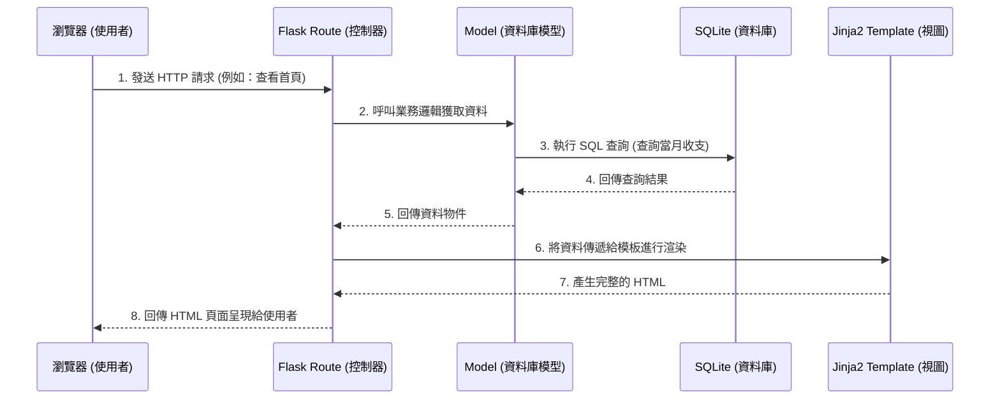

# 系統架構文件 (Architecture) - 個人記帳簿

## 1. 技術架構說明

本專案採用的技術架構與選型如下：

- **後端框架：Python + Flask**
  - **原因**：Flask 是一個輕量級的 Web 框架，學習曲線平緩，非常適合用來開發「個人記帳簿」這類中小型專案。它具備高擴充性且開發速度快。
- **模板引擎：Jinja2**
  - **原因**：與 Flask 完美整合，能夠在伺服器端直接渲染 HTML 畫面，不需要額外架設前端伺服器，降低系統複雜度與維護成本。
- **資料庫：SQLite**
  - **原因**：SQLite 是輕量級的關聯式資料庫，資料儲存於單一檔案中，無需額外安裝與維護資料庫伺服器，非常適合個人單機或小規模的應用程式。

### Flask MVC 模式說明

本系統採用類似 MVC (Model-View-Controller) 的架構來組織程式碼：
- **Model (模型)**：負責定義資料結構與資料庫互動邏輯（如收支紀錄、分類等資料表的操作），透過 SQLite 或 SQLAlchemy 來實作。
- **View (視圖)**：負責呈現使用者介面，由 Jinja2 HTML 模板加上 CSS 與前端 JavaScript 組成，負責將後端傳遞過來的資料渲染成最終網頁。
- **Controller (控制器)**：在 Flask 中主要由「路由 (Routes)」擔任此角色。負責接收來自瀏覽器的 HTTP 請求（如新增收支、查看報表），呼叫對應的 Model 處理資料，最後將結果交給指定的 View 進行渲染。

## 2. 專案資料夾結構

以下是本專案的資料夾結構與各檔案用途說明：

```text
web_app_development2/
├── app/                      # 應用程式主要模組
│   ├── models/               # 資料庫模型 (Model)
│   │   └── database.py       # 定義資料表與資料庫操作函式
│   ├── routes/               # Flask 路由控制器 (Controller)
│   │   ├── __init__.py       # 初始化 Blueprint
│   │   ├── expense.py        # 收支相關路由 (新增、編輯、刪除)
│   │   └── report.py         # 報表相關路由 (統計、圖表)
│   ├── templates/            # Jinja2 HTML 模板 (View)
│   │   ├── base.html         # 共用模板 (導覽列、頁尾)
│   │   ├── index.html        # 首頁 (總覽、最近收支)
│   │   └── add_record.html   # 新增/編輯收支表單
│   └── static/               # 靜態資源檔案
│       ├── css/
│       │   └── style.css     # 全域樣式表
│       └── js/
│           └── charts.js     # 圖表繪製邏輯
├── instance/                 # 存放不應進入版控的實例檔案
│   └── database.db           # SQLite 資料庫檔案
├── docs/                     # 專案相關文件
│   ├── PRD.md                # 產品需求文件
│   └── ARCHITECTURE.md       # 系統架構文件 (本文件)
├── app.py                    # 系統入口點，初始化 Flask 應用
└── requirements.txt          # Python 依賴套件清單
```

## 3. 元件關係圖

以下圖示展示了使用者操作時，系統各元件之間的互動流程：



## 4. 關鍵設計決策

1. **採用伺服器端渲染 (Server-Side Rendering)**：
   - 為了加快開發速度並降低專案初期的複雜度，我們選擇不使用前後端分離架構（如 React/Vue），而是直接讓 Flask 搭配 Jinja2 渲染 HTML。這對於單純的個人記帳簿來說已能提供極佳的效能與體驗。
2. **使用輕量級 SQLite 資料庫**：
   - 作為個人使用的系統，不需要高併發的資料庫伺服器。SQLite 零配置、單一檔案的特性大幅降低了部署與備份的成本，也能完美符合 MVP 階段的需求。
3. **整合第三方圖表庫處理視覺化**：
   - 針對 PRD 中要求的「圓餅圖/長條圖」報表功能，將透過前端輕量級的 Chart.js 等函式庫來實作。Flask 後端只負責整理統計資料並傳入前端，由前端負責繪製，確保職責分離。
4. **使用 Blueprint 模組化路由**：
   - 即便專案初期規模不大，仍預先規劃了 `routes/` 資料夾，並透過 Flask Blueprint 將不同功能（如一般收支操作、報表分析）拆分，避免單一檔案過於臃腫，有利於未來的維護與功能擴充。
