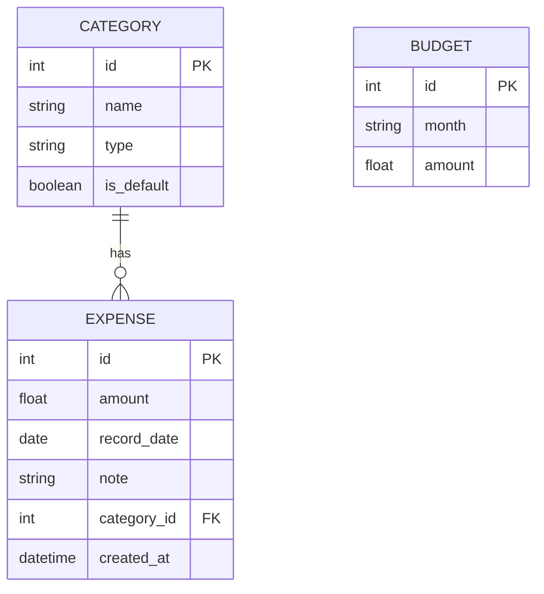

# 資料庫設計文件 (DB Design) - 個人記帳簿

本文件定義了「個人記帳簿」系統的資料庫結構，包含 ER 圖、資料表詳細規格以及對應的 Model 設計。

## 1. ER 圖 (實體關係圖)

## 2. 資料表詳細說明

### 2.1 categories (收支分類表)
負責儲存收支的分類，例如：飲食、交通、薪水等。
| 欄位名稱 | 型別 | 屬性 | 說明 |
|---|---|---|---|
| `id` | INTEGER | PK, AUTOINCREMENT | 分類唯一識別碼 |
| `name` | TEXT | NOT NULL | 分類名稱 |
| `type` | TEXT | NOT NULL | 類型，限制為 'income' (收入) 或 'expense' (支出) |
| `is_default` | INTEGER | DEFAULT 0 | 是否為系統內建預設分類 (1: 是, 0: 否) |

### 2.2 expenses (收支紀錄表)
負責儲存使用者的每一筆收入與支出明細。
| 欄位名稱 | 型別 | 屬性 | 說明 |
|---|---|---|---|
| `id` | INTEGER | PK, AUTOINCREMENT | 收支紀錄唯一識別碼 |
| `amount` | REAL | NOT NULL | 金額 |
| `record_date` | TEXT | NOT NULL | 發生日期 (格式: YYYY-MM-DD) |
| `note` | TEXT | | 備註說明 |
| `category_id` | INTEGER | FK, NOT NULL | 關聯到 categories 表的 id |
| `created_at` | TEXT | DEFAULT CURRENT_TIMESTAMP | 建立時間 |

### 2.3 budgets (預算表)
負責儲存每月設定的總預算金額。
| 欄位名稱 | 型別 | 屬性 | 說明 |
|---|---|---|---|
| `id` | INTEGER | PK, AUTOINCREMENT | 預算唯一識別碼 |
| `month` | TEXT | NOT NULL, UNIQUE | 月份 (格式: YYYY-MM) |
| `amount` | REAL | NOT NULL | 設定的預算金額 |

## 3. SQL 建表語法
完整的 SQLite 建表語法已儲存於 `database/schema.sql`，並包含初始化的預設分類資料。

## 4. Python Model 程式碼
Model 層採用 Python 內建的 `sqlite3` 實作，程式碼位於 `app/models/` 目錄下：
- `db.py`: 負責資料庫連線與初始化。
- `category.py`: 分類資料的 CRUD 操作。
- `expense.py`: 收支紀錄的 CRUD 操作。
- `budget.py`: 預算資料的 CRUD 操作。
