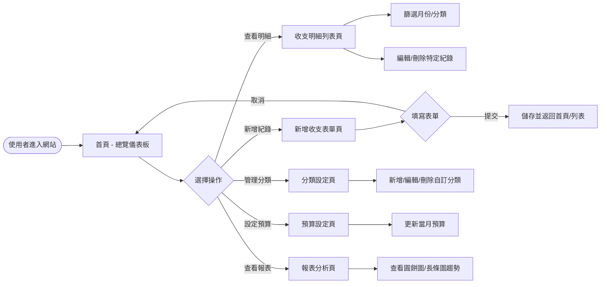
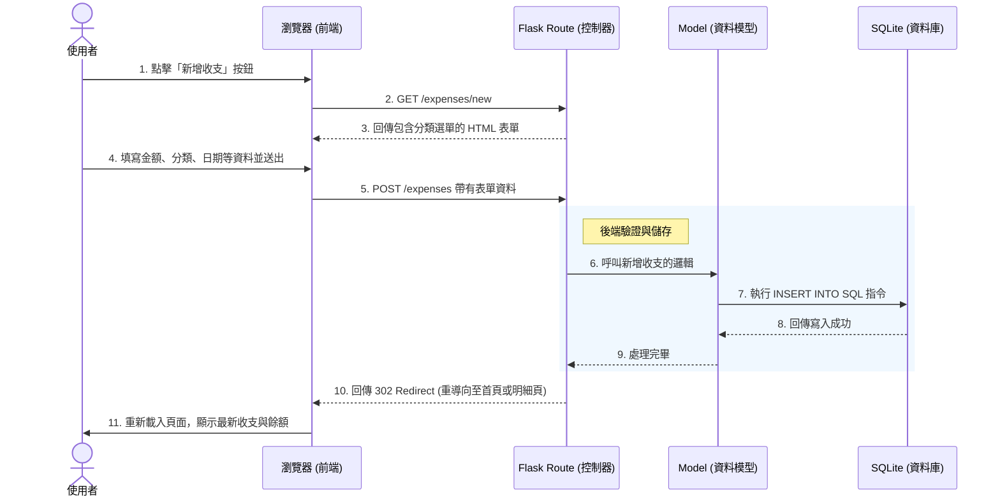

# 流程圖文件 (Flowchart) - 個人記帳簿

本文件旨在視覺化「個人記帳簿」系統的使用者操作路徑與系統資料流動流程，幫助團隊在開發階段建立一致的認知。

## 1. 使用者流程圖 (User Flow)

此流程圖展示了使用者進入系統後的主要操作路徑，包含瀏覽首頁、新增收支、管理分類與檢視報表等。

## 2. 系統序列圖 (Sequence Diagram)

此序列圖描述了使用者在「新增收支紀錄」時，系統各元件（前端瀏覽器、Flask 後端、SQLite 資料庫）之間的互動時序與資料流。

## 3. 功能清單與路由對照表

以下整理了系統主要功能所對應的 URL 路徑與 HTTP 請求方法，可供後續 API 與路由設計參考：

| 功能模組 | 功能描述 | URL 路徑 | HTTP 方法 | 備註 |
|---|---|---|---|---|
| **首頁總覽 (Home)** | 顯示當月餘額、近期收支與預算進度 | `/` | GET | 渲染 `index.html` |
| **收支管理 (Expense)** | 瀏覽所有收支明細（可加上條件過濾） | `/expenses` | GET | |
| | 顯示新增收支表單頁面 | `/expenses/new` | GET | |
| | 提交新增的收支資料 | `/expenses` | POST | 成功後重導向 |
| | 顯示編輯特定收支表單頁面 | `/expenses/<id>/edit` | GET | |
| | 提交編輯後的收支資料 | `/expenses/<id>` | POST | |
| | 刪除特定收支紀錄 | `/expenses/<id>/delete` | POST | |
| **分類管理 (Category)** | 瀏覽分類列表與新增表單 | `/categories` | GET | |
| | 提交新增分類資料 | `/categories` | POST | |
| | 刪除特定自訂分類 | `/categories/<id>/delete` | POST | |
| **報表與預算 (Report)** | 查看圖表分析（圓餅圖等） | `/report` | GET | |
| | 提交並更新當月預算設定 | `/budget` | POST | 可在總覽頁操作 |
